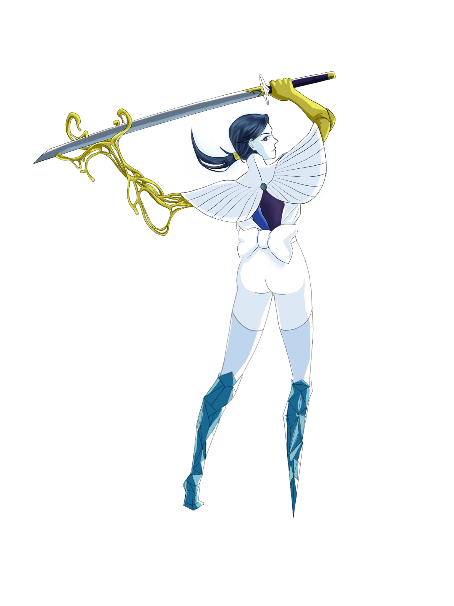
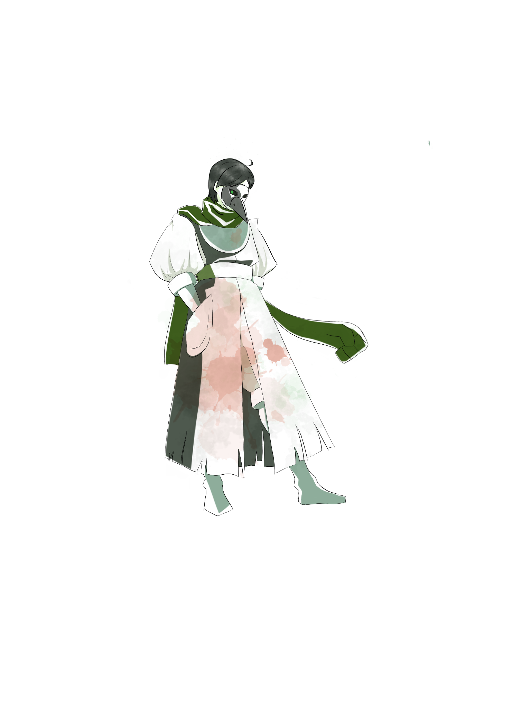
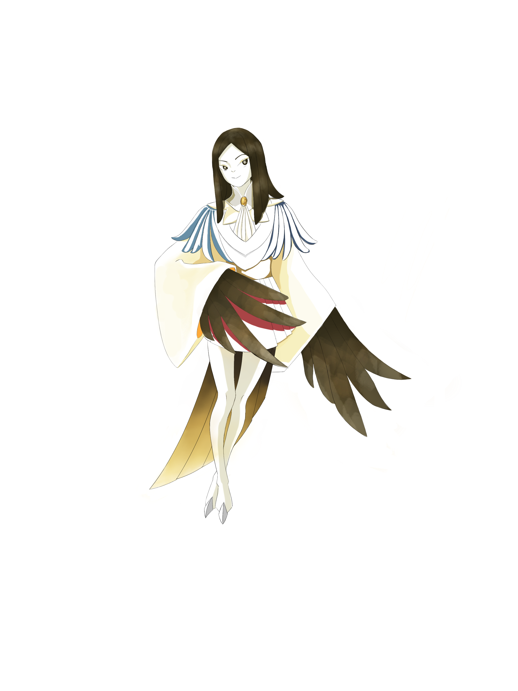

# RHHS Survival Game Design Documentation

This is the design documentation for the game. If you have general things to add, add them here. If you don't know how to edit a .md file, read the guide in the same documentation.

## Table of Contents

  1. [Plot](#plot)
  2. [Setting](#setting)
  3. [Characters](#characters)
     * [Protagonist](#prot)
     * [Friendly NPCs](#friendly)
     * [Mobs](#mobs)
     * [Mini-Bosses](#mini)
     * [Student Bosses](#stuboss)
     * [Teacher Bosses](#teachboss)
     * [4 Horsemen of RHHS-pocalypse](#horses)
     * [List of All Characters](#allChars)
  4. [Items](#items)
      * [Consumable Items](#consumable)
      * [Equipped Items](#equipped)
      * [List of All Items](#allItmes)
  5. [Abilities](#abilities)
      * [English](#eng)
      * [Math](#math)
      * [Physics](#phys)
      * [Chemistry](#chem)
      * [Biology](#bio)
      * [Music](#music)
      * [Teacher Only](#teachOnly)
  6. [Status Effects]()
  7. [Stats]()
  8. [Combat]()
  9. [Progression]()
  10. [How to edit this file]()

## Plot

  Like I was thinking the protagonist would be a normal AP kid
And then when school ends they discover they can’t leave school
And then Theo comes and be like “yeah lmao this is actually purgatory and you have to fight your way out”
Gives you some pendant that can revive you and leaves
Because it’s purgatory everyone is like corrupted and wants to kill you for various reasons
You have to defeat them and use the pendant Theo gave to purify them cause everything Theo touches is op
Or like kill them
But if you kill them you start to corrupt yourself
The last boss you have to beat before escaping the school is your depression and anger built throughout the game
If you decided to kill everyone it’s a guaranteed game over and you turn into the schools root of all evil
If you befriended everyone you stomp your depression and find yourself waking up in AP chem
(Would be cool to tie in Divine Comedy elements into the game, idk tho I’m not Christian)
(Ok so I thought after beating the 4 horsemen you get a piece of a relic which is used to defeat the final boss. Thoughts?)

## Setting

 RHHS (duh) but arranged in [*Purgatorio*](https://en.wikipedia.org/wiki/Divine_Comedy#Purgatorio) style, so layers and shit. Maybe make classrooms dungeon-like, or seperate things into pods, each of which is like its own dungeon.

 Layers of RHHS:

* Layer 1: Ante-purgatory (caf + gyms)

  * Encounter [Gissing](#gissing)
  * Familiarize game mechanics
  * Mobs
  * Mini-boss: [AP exams](#ap)
* Layer 2: Pride (Math Classroom)
  * Find [Choi](#choi)
  * Mobs
  * Student Boss [Kevin](#kevin)
* Layer 3: Envy (Chem lab)
  * Find [Mrs. K](#mrsk)
  * Mobs
  * Student Boss [Aryan](#aryan)
* Layer 4: Wrath (Physics room)
  * Find [Mrs. Leung](#leung)
  * Mobs
  * Student Boss [Jerry](#jerry)
* Layer 5: Sloth (Bio room)
  * Find [Hazlewood](#hazlewood)
  * Mobs
  * Student Boss [Ivy](#ivy)
* Layer 6: Greed (English classroom)
  * Find [Cimetta](#cimetta)
  * Mobs
  * Student Boss [Alicia](#alicia)
* Layer 7: Gluttony (Room 2024)
  * Find [Shim](#shim)
  * Mobs
  * Student Boss [Jennifer](#jennifer)
* Layer 8: Lust (Chem classroom)
  * Find [Spatafora](#spat)
  * Mobs
  * Student Boss [Allen]()
* Layer 9: "Earthly Paradise" (weird spce time continuum)
  * Find horsemen in order of Joon --> Sarah --> Bryan --> Sophia
  * After all 4 horsemen are defeated, you get back to Layer 1
  * Choose to either grind or go straight to the final boss

  Either the music room or the elevator will act as a fast travel.

  WILD IDEA: Can we add outside / the forest somehow?

## Characters

### Protagonist

"You", a blank character. Literally a blank slate. Super customizable. Have fun surviving.

### Friendly NPCs

#### Mr. Gissing, the only friendly NPC

* Runs a shop probably where you can buy items.
* Very nice guy. Very nice.
  

#### Theo, our lord and saviour

* OP. Super OP.
* Gives you the [pendant](#pendant) and you'll never see him again :)

### Mobs

#### Zombie Students (male and female)

* Well not literally zombie students, just students who have no conscious mind and will destroy you like zombies
* Low damage, easy to kill, low rewards

#### DECA, just DECA

* Manifests as some ghast probably?
* Higher damage and slightly harder to kill, high money reward.
* Passive: low chance to confuse players with BS.

#### Band, just Band

* Ghast thing #2
* Same as DECA
* Passive: low chance to deafen players bc noise

#### Sleep deprivation monster

* Ghast #3
* High damage, hard to kill, high rewards.
* Passive: lowers HP by 10% and PP by 1 for a random move.

### Mini-Bosses

#### FON Gang

* Everyone’s favorite IMF, now trying to attack you with hydrogen
* Fluorine tries to kill you
* Oxygen tries to buff or debuff
* Nitrogen tries to tank
* Each turn, one element gets some hydrogen buff (shield/powerful ability access)

#### AP Exams

* Ghast #4
* Almost the same level as a student boss
* Passive: deals high subject specific damage

### Student Bosses

  They're all corrupted students so it's best not to kill them lol. What will you do for alt path (not killing them)? Each person is responsible for adding their own stuff

#### Allen

* Passive: All according to plan
  * Swaps a random music/chem ability for each turn (I dunno what theme to go with) 
  * Has a stupid pun the first time an ability is used
* Reward:
  * [Tea](#tea): Weakens Spatafora
  * Equal chance of dropping [music sheets](#musicSheet) or [chem coursepacks](#coursepack)

#### Aryan

* Passive: I’m Coming
  * Legends have it last time Aryan made a good joke earth was still round. Aryan makes a stupid joke each turn which makes the oponent deaf for 1 turn.
* Reward:
  * [Vodka Jam](#vodka): Weakens Kostanenko.
  * [Chem coursepacks](#coursepack): use to up your chem stats

#### Alicia

* Passive: A *pun*dit if puns
  * Gives her huge protection against English based attacks and increases her english-based attacks greatly.
* Reward:
  * literature books, good for upping your English stats
  * [Poetry anthology](#poetry): weakens Cimetta

#### Ivy

* Passive: Where's my coffee?
  * Because she has an addiction to caffeine (that she wouldn’t admit), she has double the PP limit.
* Reward:
  * drops [espresso](#espresso), effective in weakening Hazlewood.
  * Also drops [Theo’s tests](#pastTest), use to up your bio stats

#### Jennifer

* Passive: I'm not mad
  * Believe me, you do not want to see Jennifer mad. Has a 50% chance to go angry and double her attack for 2 turns.
* Reward:
  * [Bougie KitKats](#kitkat): weakens Shim
  * [Textbook questions](#textbook): Increases your math stats.

#### Jerry

* Passive: What?
  * When have you seen Jerry give a shit about anything? That’s right. Never. Immune to all status effects (4 horsemen and final boss are exceptions)
* Rewards:
  * [TLAP](#tlap): Weakens Leung
  * “Nothing”: Raises physics stats

#### Kevin

* Passive: Procrastinate
  * Getting work done before the due date? That’s not going to happen. When Kevin’s health is below 20%, he gets one extra action each turn
* Reward:
  * [Red pocket](#homework): Weakens Choi
  * [unused schedule](#unused): equip that allows the user to do more damage the lower on health they are
  * [VBC secrets](#vbc): boosts effectiveness against DECA enemies

### Teacher Bosses

  If you want to a teacher added, feel free! Only seven for now, because seven deadly sins.

#### Pride: Choi

* Passive: It wasn’t hard [smirks]
  * Mr. Choi is literally too cool for all of us plebs and our pleb attacks. Reduces all damage received by 15%.
* Reward: Blessing of humility
  * Receive a 10% damage reduction for all attacks?

#### Gluttony: Shim

* Passive: Ooh, what’s that?
  * Better hide your food from Mr. Shim, cause he’ll want his share! Or you could be like Sarah and bribe him with bougie KitKat and baked goods ;). Consumes a random ability or consumable item for each turn.
  * Spani*Sh im*quisition. I don't know yet
* Reward: Blessing of temperance
  * The later the ability is used, the higher the damage.

#### Greed: Cimetta

* Passive: Can you be more specific?
  * **Be specific**. Mr Cimetta I’m only in high school. **Be specific**. Mr Cimetta I only have 300 words. **Be specific**. Mr Cimetta it’s only an in class essay. **Be specific**. Steals 10% HP from each team member and 1PP on a random move each turn.
* Reward:
  * Blessing of of generosity - all characters in the party get huge stat increase (idk how huge), especially in English.

#### Wrath: Leung

* Passive: :)
  * Mrs. Leung is such a chill teacher. She’s so nice. If only her tests don’t destroy my mark.
At the expense of a 10% HP reduction each turn, her attacks deal double damage
* Reward:
  * Blessing of peace - All future moves have 25% more PP.

#### Sloth: Hazlewood

* Passive: Dead inside
  * Apparently Mr. Hazlewood was super scary. But then he had kids and lost his hair. Now Shim looks younger than him. Spat looks younger than him. Even Delbi looks younger than him. F to Mr Hazlewood.
When he “sleeps”, he is immune to all received damage while doing no damage. Lasts for 2-3 turns.

* Reward:
  * Blessing of diligence - when a party member first dies, they revive with 20% HP.

#### Envy: Kostanenko

* Passive: I love Chemistry
  * Mrs. Spat loves chemistry so much I can’t count the number of violations she made while doing demos. But hey, at least she never tasted chemicals in the lab ;)
Revives her with 50% HP.
Rewards: Blessing of chastity - party members who have not attacked this battle are immune to status effects
* Reward:
  * We should add one

#### Siu (Optional Boss)

* Passive: Band is a serious passion!
  * Band is a serious course only for students with a serious desire to go into music. If you don’t spend 40 hours a day practicing I WILL FAIL YOU.
Gains power for each party member without an instrument/music item

  * Immediately deals damage to any student who swaps in

* Rewards:
  * We should add one.

#### Spatafora (Optional Boss)

  Come up with stuff

#### Mangat (Optional Boss)

  Compe up with stuff

### 4 Horsemen of RHHS-pocalypse

#### War: Joon

* Passive: Man of War
  * He’s so violent. So chaotic. Breaks everything. Rulers, curves, Sarah’s head. And we’re pretty sure it’s all by accident.
    50% chance to enrage players and cause them to hurt each other for one turn
  * Temporarily breaks consumable items so you can’t use it.

* Reward:
  * Piece of relic

#### Famine: Sarah

</img>

* Passive: Kirby 2.0
  * Anything and everything is edible In Sarah’s eyes. She has eaten old spinach leaves, glass, potassium chloride and even fucking mercury. She is still healthy for some reason.
30% chance for attacks to be absorbed, healing her HP.
  * Makes party members hungry, bleeding out HP (10% each turn)

* Reward:
  * Piece of relic

#### Pestilence: Bryan

</img>

* Passive: Patient Zero
  * Does anyone remember how many times Sophia was sick after Bryan was sick? Three? Four? Makes party members sick, reducing PP by 1 each turn. (For fun: anyone with sickness spreads it to whoever they target with abilities, if everyone in combat has sickness, do X bad thing)
  * Attacks reduce 20% in damage

* Reward:
  * Piece of relic

#### Death: Sophia

</img>

* Passive: Thriller Night
  * Sophia is so nice and chill everyone likes her. So it’s ok if she brings them back from the dead to fight for her, riiiiight?
Summons zombie students to fight for her every 5 turns.
(For fun: Can summoned named students that you’ve killed)
  * Will kill your entire party after 50 turns

* Reward:
  * Piece of relic

#### Conquest: Depression TM

  Like the first horsemen, Depression TM is truly the root of all evil.

* Passive: I’m just trash
  * You dread it, you run from it, it will still get ya. Be warned. Reduces damage received by 40%
  * Chance of getting deaf, confused or stunned
  * Debuff: enemy must kill off every character in the game to win

* Reward:
  * escape school / purgatory

### All Characters

  Here is a list of all characters in the game sorted in alphabetical order. Click on the links to navigate to them.

* [Allen](#allen)
* [AP exams](#ap)
* [Aryan](#aryan)
* [Alicia](#alicia)
* [Band](#band)
* [Bryan](#bryan)
* [Cimetta](#cimetta)
* [Choi](#choi)
* [Deca](#deca)
* [Depression](#depression)
* [FON Gange](#fon)
* [Gissing](#gissing)
* [Hazlewood](#hazlewood)
* [Ivy](#ivy)
* [Jennifer](#jennifer)
* [Jerry](#jerry)
* [Joon](#joon)
* [Keving](#kevin)
* [Kostanenko](#mrsk)
* [Leung](#leung)
* [Mangat](#mangat)
* [Protagonist](#prot)
* [Sarah](#sarah)
* [Shim](#shim)
* [Siu](#siu)
* [Sleep Deprivation](#sleep)
* [Sophia](#sophia)
* [Spatafora](#spat)
* [Theo](#theo)
* [Zombies](#zombies)

## Items

### Consumable items

#### Coffee

Restores PP

#### Rice

Restores HP

#### Bubble Tea

Rids all status effects on a character. Inefective against the 4 horsemen and final boss.

#### Bulk Barn Candy

Increases chance of purifying opponents without fighting. Ineffective against final boss.

#### Homework

Increases chance of depressing student bosses.  
Ineffective against Jerry.  
Red pocket: Weakens Mr. Choi.

#### Poetry anthology

Weakens Mr. Cimetta.

#### Bougie KitKat

Weakens Mr. Shim.

#### TLAP

Weakens Mrs. Leung.

#### Espresso

Weakens Mr. Hazlewood.

#### Vodka Jam

Weakens Mrs. Kostanenko.

#### Tea

Weakens Mrs. Spatafora.

#### Unlabeled Salt

*Random* effect(s). No negative effects if Sarah consumes.

#### Textbook questions

randomly increases math stats

#### Worksheets

randomly increases physics stats

#### Theo’s past tests

randomly increases bio stats

#### Coursepacks

randomly increases chem stats

#### Music sheets

randomly increases music stats

#### VBC secrets

increases damage dealt to DECA enemies.

### Equipped items

#### Unused schedule

Gives players 1 extra action each turn if their HP is below 10% of their normal level.

#### Whiteboard

Increases damage by 5% against enemies. Increases damage by 20% when facing Sarah.

#### Musical Instrument

Increases music attacks by 10%

#### Lab coat

Increases chem and bio attacks by 10%

#### Plain old calculator

Increases math attacks by 10%

#### Meter stick

Increases physics attacks by 10%

#### Theo’s pendant

If chosen to spare an opponent, purifies them and adds them to your team.

### All Itmes

Here is a list of all items in the game sorted in alphabetical order. Click on the links to navigate to them.

* [Bougie KitKat](#kitkat)
* [Bubble Tea](#bubbleTea)
* [Bulk Barn Candy](#bulkBarn)
* [Coffee](#coffee)
* [Coursepacks](#coursepack)
* [Espresso](#espresso)
* [Homework](#homework)
* [Lab Coat](#coat)
* [Meter Stick](#stick)
* [Music Sheets](#musicSheet)
* [Musical Instrument](#musical)
* [Plain old calculator](#calculator)
* [Poetry anthology](#poetry)
* [Rice](#rice)
* [Tea](#tea)
* [Textbook questions](#textbook)
* [Theo’s past tests](#pastTest)
* [Theo’s pendant](#pendant)
* [TLAP](#tlap)
* [Unlabeled Salt](#salt)
* [Unused schedule](#unused)
* [VBC secrets](#vbc)
* [Vodka Jam](#vodka)
* [Whiteboard](#whiteboard)
* [Worksheets](#worksheet)

## Abilities

### English Abilities

#### Dramatization

A “reliable” mark booster after a disastrous in class essay.

* Damage: 100
* PP: 12

#### Constructive criticism

Bro, what’s up with your essay? The grammar is atrocious, the logic is flimsy and you’re not even answering the prompt.

* Increases English attacks by 25%

#### Shakespearean roasting

 It’s ok if you swear in class as long as it’s clever. With the power of Shakespearean roasting you can curse as freely as you want.

* Damage: 40
* PP: 20

#### Journal reflections

You always get free marks for this. Even in John’s class.

* Restores HP by 20%.
* PP: 10

#### Cimetta’s roasts

How do you even manage to not answer the prompt? Or not be specific? Or not have any arguments?

* Damage: 150
* PP: 5
* Only usable by [Cimetta](#cimetta)

#### In-class essay

The bane of my English mark. Or frankly most people’s English marks.

* Damage: 150
* PP: 5
* Cannot use if your English stat is low

#### ISU

 I swear to god. If I have to write another 1600 word essay I will go kill a man.

* Damage: 180
* PP: 1
* 30% chance to hurt yourself, reducing 10% of your HP unless your English stat is high.

### Math Abilities

#### Graph and Pray

You just saw sin(X)/log(x) and you have no memory of how to do it. Quick, draw something!

* Damage: 40
* PP: 20

#### Sandwich Theorem

Who needs limits? Who needs derivatives? Just sandwich everything lol.

* Damage: 90
* PP: 12

#### Thinking Section

You’ve probably never seen this stuff before but it’s “easy”.

* Damage: 90-180 (depends on your math stats)
* PP: 5
* If your math stats are not high enough, you deal damage to yourself

#### Ti-84 CE Plus

Don’t lie to yourself, you know it’s a crutch to you right now

* Increases math attack damage by 15%.
* Ineffective when facing Shim.

#### Calculate Mark

omgomgomgomgomgomgomgomg HOW MUCH IS MY MARK GONNA DROP?

* Damage: 40
* PP: 20
* 40% chance to deal damage to self, reducing PP by 1 on another move at hand

#### Past Tests

Yo, can you sauce me last year’s trig test?

* Reduces math damage by 20%.
* 20% chance buff fails

#### Trig Identities

Lets see, sin(2x)=2sinxcosx, cos2x=2cos2x-1 or cos2x-sin2x or… crap what was it again?

* Damage: 120
* PP:10

#### Mark Tests

Dude what the ...? How’s our final exam mark up now? We literally did it last period?

* Damage: 150
* PP: 5
* Only usable by [Choi](#choi)

#### Graph the Equation

Omg, 12 free marks? Sign me up!

* Damage: 150
* PP: 5

#### Change Questions

So I changed around the given and what you wanted to get and suddenly half the class doesn’t know what to do.

* Damage: 150
* PP: 5
* Only usable by [Choi](#choi) and [Shim](#shim).

#### Life Lesson

Look my young Padawans, you should worry about the learning and let the marks take care of themselves.

* Damage: 100
* PP: 10
* Only usable by [Shim](#shim)

### Physics Abilities

#### Charge/Electric Shock

All you need is a chair and a victim!

* Damage: 40+120 per charge
* PP: 10
* Use on yourself to charge up

#### Not Physics

Who does physics in physics? I have to study for the bio and chem tests later today! Oh and also the math test tomorrow.

* All physics type moves become one of either math, biology or chemistry.
* Makes [Leung](#leung) even angrier, causing her to deal 2.5x damage

#### Play with Equipment

All of them make handy weapons, didn’t you notice?

* Damage: 90
* PP: 15

#### Physics Test

Damn! My mark went down by 5% again!

* Damage: 120
* PP: 10
* Only usable by [Leung](#leung)
* only deals 60 damage to [Jerry](#jerry)

#### Feynman Joke

Physics is like sex. Sure it gives practical results, but that’s not why we do it.

* Damage: 100
* PP: 12
* Damage increases by 15% when used by [Aryan](#aryan) or [Allen](#allen)

#### Fond Memories of Gissing

“Dude, the U class has a median of 96”.

* Recovers team health by 10%.

#### Rotating Fields

The worst two nightmares of an AP physics student combined together. Does it actually work in reality? We’re in purgatory, who cares!

* Damage: 150
* PP: 5
* Cannot use unless physics stats are high

### Chemistry Abilities

#### Stoichiometry

It’s easy. It’s just math. Somehow it was my worst unit.

* Damage: Based on chem stat
* PP: 15

#### Titration

dOn'T fOrGeT tO pUt YoUr inDiCAtOr!

* Damage: 150
* PP: 5

#### Splash Acid

Oh dear I have acid everywhere! Ivy’s coursepack has a burning hole!

* Damage: 120
* PP: 10
* Ineffective when used against Spatafora. When used by Spatafora, damage increases by 10%.

#### Spill Salt

Oh I spilled salt everywhere. Lemme clean it up.

* Damage: 40
* PP: 20
* Ineffective against [Sarah](#sarah)

#### Orgo Names

So you’re supposed to number the carbons in the longest chain, and then look at the branches, and then put the branches as the prefix in the right position and the parent chain as the suffix. But then you have other functional groups that have different priorities, and double bonds have E and Z, and chirality is a thing, and...

* Damage: 180
* PP: 1

#### Taste Eest

Hmm, I wonder what this is?

* Increases chem attack damage by 15%
* Reduces HP by 10%
* Ineffective against [Sarah](#sarah)

#### The Model is Wrong!

Forget everything you’ve learnt in grade 9, 10 or 11. It’s all wrong!

* Reduces enemy attacks by 15%
* Ineffective against [Kostanenko](#mrsk) and [Spatafora](#spat)

#### Return Textbook

If you return the textbook on exam day, you will receive one bonus mark!

* Recovers HP by 5%
* Recovers PP by 1

#### Bonus Question

It’s supposed to give you free marks, but all it does is give me anxiety.

* Damage: 130
* PP: 8
* Only usable by [Spatafora](#spat) or [Kostanenko](#mrsk)

### Biology Abilities

#### 40 Phylums

40 Phylums: So you have the Cercozoa, and the Ciliophora, and the Zoomastigina, and the Sporozoa, and the Myxomycota, and the Acrasiomycota, and 34 other phylums to remember for the test!

* Damage: 120
* PP: 10
* Deals half the normal damage to [Hazlewood](#hazlewood).

#### Dissections

Don’t accidentally cut up the inferior vena cava because you thought it was lymphatic tissue!

* Damage: 90
* PP: 15

#### Read the Textbook

Half of it is skipped anyways but it’s still helpful! Maybe?

* Increases damage of biology moves by 15%

#### Theo’s tests

Innovative way of studying: look at Theo’s tests!

* Reduces received biology damage by 10%

#### Micropipetting

on’t reuse the tips, don’t puncture the wells, don’t shake it around, and *do not break it. Ever*.

* Damage: 40
* PP: 20

#### Jurassic Park

One of Hazlewood’s favorite movies. Just hope he doesn’t put anything related to it on the test.

* Damage: 60
* PP: 15
* Heal self for the same amount of damage dealt (60).

#### Homeostasis Project

Thank the heavens! My bio mark is finally saved! What do you mean, I have to work for this?

* Damage: 150
* PP: 5

#### Multiple Choice

What do you mean, choose the correct answer? All of these seem right!

* Damage: 150
* PP: 10 (that’s right, Hazlewood fucks with you that much)
* Only usable by [Hazlewood](#hazlewood)

#### Short Answer

So I got one mark off of each question and my application mark is a 69. Nice.

* Damage: 100
* PP: 15
* Only usable by [Hazlewood](#hazlewood)

### Music abilities

#### Scapegoat flutes

There are 27 of you. PLAY QUIETER

* Damage: 60
* PP: 15
* If used against a flute player, they get an attack debuff

#### Oboe = Clarinet

You do not want to call the Oboe a Clarinet, trust me

* Damage: 90
* PP: 10
* If used against an oboe player, they get enraged.

#### French Horn Benefits

“My favorite instrument is the french horn” -all music teachers

* Heals all allies by a certain amount

#### Horns/Bells up

“I can’t hear you!” But seriously, when can’t you hear a trumpet?

* The next damaging musical ability deals double damage

#### Holiday Serenade

Almost got cancelled!

* Damage: 150
* PP: 10

